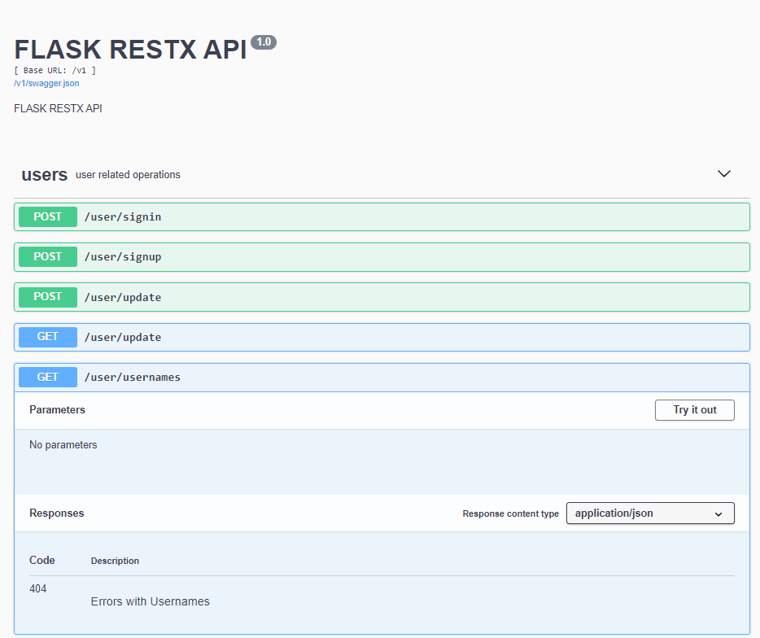
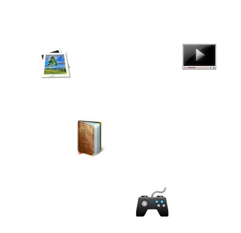

# Coin2Gether (C2G)

> Please note that the code and contributions in this GitHub repository were created through a collaborative effort by [@Irish-77](https://github.com/Irish-77), [@Ronho](https://github.com/Ronho), and [@FHeidger](https://github.com/FHeidger). All contributors acknowledge that their work is of equal merit and that they each have a deep understanding of the other's contributions.


Coin2Gether (C2G) is a social media platform designed to create transparency and trust in the knowledge exchange of the cryptocurrency market. The platform aims to counter the false information spread by self-proclaimed crypto experts or gurus who lack knowledge or want to enrich themselves.
At C2G, users can sign up, follow other users, and publish blog posts to exchange information about the current market situation. However, the core feature of C2G is the ability for users to publish their trades (cryptocurrency transactions). Users specify which cryptocurrency they want to exchange, how much profit they expect to make, and when they expect to realize the profit. By checking whether the prediction was correct even after the specified period, the platform can determine whether a user has expertise in the market.
Each user has a virtual portfolio, where they are able to deposit their fiat and cryptocurrency holdings virtually. Only currencies stored in a user's portfolio can be used to publish a trade. Users can see the posts and trades of only the users they follow, and can also view a summary of correct and incorrect trades on each user's profile page.
C2G also includes a recommendation system that suggests other users to follow and a chatbot to assist new users with the platform. Join us on C2G and exchange knowledge and insights in a transparent and trustworthy way.

## Table of contents
1. [Installation](#installation)
    - [Local Build](#local-build)
        - [Database](#database-setup)
        - [Server](#server-setup)
        - [Client](#client-setup)
    - [Alternative Setup with Docker](#alternative-setup-with-docker)
1. [Description](#description)
    - [Platform](#platform)
    - [Server](#server)
    - [Client](#client)
    - [Chatbot](#chatbot)
    - [Recommender System](#recommender-system)
    - [Monitoring Dashboard](#monitoring-dashboard)
    - [Database](#database)
1. [Further Reading Material](#further-reading-material)


## Installation

### Local Build
To be able to use all functions properly, the following applications must be installed on your system:
* [Docker](https://www.docker.com/)
* [NodeJs](https://nodejs.org/en/)
* [Python](https://www.python.org/downloads/)
* [Git Bash](https://git-scm.com/downloads)

First, clone this project by running the command:

```sh
git clone https://github.com/C2G-BR/Coin2Gether.git
```

#### Database Setup
Next, we have to setup the database. It is important that the database is setup before the server is being turned on.
Run the following command:
```sh
docker-compose -f docker-compose-only-db.yml up
```
Once the container is active, you can continue setting up the server/backend.

#### Server Setup
First, install all required packages.
```sh
pip install -r requirements.txt
```
Next we can run the server by executing following command:
```sh
python manage.py
```

#### Client Setup
Navigate to the directory of the client/webapp and execute the following command:
```sh
npm install
```
After all packages have been installed, run the project by typing in:
```sh
npm run de
```
or
```sh
npm run en-US
```

### Alternative Setup with Docker
If you do not wish to conduct any code changes, you are also able to setup the complete project immediately.
To do that, run:
```sh
docker-compose -f docker-compose-full-app.yml up
```
If you wish to create every image from scratch, make sure to replace the word "localhost" with "db" within the Database-URI for the following files:
* [Config Monitoring Dashboard (server/config.cfg)](server/config.cfg)
* [Environment File Flask (server/app/.env)](server/app/.env)
Do not comment anything within .cfg-files, since the config handler is not able to handle comments in such a context.

You can now build the client image by running the command:
```sh
docker build -t client .
```
To run this image execute the following command:
```sh
docker run --name client -p 8888:80 client
```

The server image can be built likewise:
```sh
docker build -t server .
```
To run the backend execute the following command:
```sh
docker run --name server -p 5000:5000 server
```

## Description

### Platform

The platform is described below:
* If a user is not logged in yet, he will be redirected to the landing page when visiting the site.

    

* The public feed page shows all blog entries and all posts. A guest user who is not logged in still has the opportunity to view the public feed.

    

* Various pages can be accessed via the navigation bar. Some of them require an account. If you are not logged in and click on a page that requires an account, you will be redirected to the login page instead.

    

    C2G offers the possibility to search for other users with our searchbar.

    

* A user is able to either log in with an existing account or register a new one. It is also possible to change the user's data afterwards. Furthermore, other social media accounts (such as TikTok, Instagram, LinkedIn, etc.) can be linked. In addition to the public feed, there is also a private feed. This is only visible to logged-in users and shows a user only the blog posts as well as the published trades of users that he or her follows. In addition, the private feed also suggests other users, who might suit this user due to similar interests regarding asset classes (see more about this at [Recommender System](#recommender-system)).

    

* Users who are logged in have their own profile page and are eligible
to view the profile pages of others.

    

    The portfolio is also located on this profile page. This can be customized as desired by the owner of the respective page. All currencies are then converted into USD ($).

    


    Additionally, you can find a graph about the trading performance. This should indicate how much experience/knowledge the corresponding user has. The data basis for this are historical trades.

    

    Furthermore, all trades as well as blog posts of the user are listed on their profile page.


* Besides blog posts, trades can also be published on C2G:

    

* Overview of the technical process flow of the business operation involved in the publication of new trades:

    

* Coin2Gether is a platform consisting of several systems, which are connected as follows:

    


### Server
The server (backend) was developed using the Flask framework and provides Swagger documentation. The Swagger integration environment is available at ```127.0.0.1:5000/v1```. Swagger provides the ability to test the various APIs. Some routes require an authorization header, which can be obtained by successfully logging in.



Each user's portfolio includes their assets in the corresponding currencies. The value of each currency is converted to USD. For this we connect to [CoinAPI](https://www.coinapi.io), which sends us the real-time exchange rates of these currencies.


### Client
The client (frontend) was written using Angular 2+ and is now running on 14th version of Angular.
The frontend contains the following additional functionalities:
* Light and dark mode support
    
    

* Internationalization (i18n) for the languages English and German
* In large parts responsive
* Certain pages can be accessed only by authorized users


### Chatbot
As part of the *C2G Goes AI* initiative, we explored how AI can be used to leverage the user experience. We identified potential for a user recommender system and a chatbot. The purpose of the chatbot should be to help our users finding their way through our platform.

1. **Functionalities**:
    - *Information inquiry*: An important task of the chatbot is to educate and support the user about the platform and how to operate it, e.g. how to find certain pages.
    - *Actions*: A special ability that differentiates our chatbot from traditional chatbots is the ability to perform certain actions. This can range from asking the chatbot how to find a page by instructing it to navigate to that page over to asking the chatbot to create a post for you. The chatbot retrieves the important information and then creates the post.
    - *Interactivity*: To ensure that the chatbot does not just answer questions about the platform and thus appears static, we have added further intents to give the chatbot a certain degree of liveliness - with a lot of humor, of course.
1. **Implementation**:
    - *Model*: For model selection, we considered several models, including BERT which was retrained on our data using transfer learning. However, the model results were best with a neural network trained from scratch, so this was used in production.The input for each model first passes through our custom NLP pipeline. Here, a lemmatizer is first applied to the input text and then using the Bag of Words technique, the text is transformed into the corresponding input vector.
    
        

    - *Stories and Sessions*: To minimize the speed of loading the frontend resources, it was decided to load the chatbot model in the backend. However, this decision raises problems with communication. Namely, the chatbot is able to process *stories*. Stories are defined as a communication flow that consists of several predefined steps. Now, since the chatbot is stored in the backend, a correct mapping must be ensured. In order to know what was the last step of which user in which story path, we utilize session IDs. Those are sent back and forth between the server and the client.
    
        

1. **Results**: 
    - In addition to the training data we created on our own, we also generated test data that we can use to examine the model. An excerpt of the results with the production model on the test data is shown below:
    
        

        Some misclassifications were not understandable, so we investigated these errors in more detail using Explainable AI which we then used to further enhance the model.
        The following is an image that shows how we examined two similar example inputs. "Create a post." and "Create a post for me." imply the same in terms of content and information. However, the chatbot interprets the first input as a question like "Where do I need to navigate to create a blog post?". In contrast, in the second cell, the chatbot correctly interprets the statement as a command. With Explainable AI, we found that the words "for" and "me" play a significant role in the correct intent classification. 
    
        

1. **Client**:
    - After the story path has been successfully executed, a confirmation prompt is displayed, asking the user to decide whether they are comfortable with their input. 

        

        


### Recommender System

A recommender system generates the top-n most suitable items for a given event or item. The purpose of the recommender system at C2G is to recommend suitable users to follow. 

Our recommender system consists of two components:


1. **PageRank**: The PageRank algorithm is a technique that determines the link popularity of a node. Here, the following rule applies: "The more users follow another user A, the higher the weight of this user" and "The higher the weight of a user A, the greater the effect when user A follows another user". In contrast to e.g. Facebook, the connections are not bidirectional, i.e., User A follows User B, but the opposite direction does not necessarily apply. Accordingly, clusters emerge. The PageRank algorithm can handle these structures particularly well.


2. **Collaborative Filtering**: The PageRank algorithm can be personalized, i.e. certain users are preferred when determining the node weight. In C2G, personalization takes place through collaborative filtering. Collaborative filtering makes it possible to determine the similarity of items based on their frequent occurrence together.

    

    More specifically, C2G identifies users who have a similar portfolio.

    The similarities, in the case of C2G it is the cosine similarity, are then passed to the PageRank algorithm as a personalization vector.

    

To put in a nutshell, popular users are recommended to a user who also complement the user in terms of content, i.e. who have a comparable portfolio.

An example follows:


A preview of the frontend/client implementation:


### Monitoring Dashboard
The [Flask Monitoring Dashboard](https://github.com/flask-dashboard/Flask-MonitoringDashboard/) is a tool for monitoring the API with an incorporated dashboard. In order to access this dashboard, open the link ```127.0.0.1:5000/dashboard``` and log in with the user *admin* (password: *admin*). The data that the dashboard logs is also stored in the Postgres database.


### Database
All data is managed in a PostgreSQL database. The database is created at the first initial start of the server. Psycopg2 is used as driver to communicate with the database. As programming interface SQLAlchemy is used for the most part.
Furthermore pgAdmin 4 is used as administration interface.
To log in to pgAdmin, open the ```localhost:8080``` page.
The user is *admin@linuxhint.com* (password: *secret*).
Now the database server must be added.
To do this, right-click on "Server" > "Register" > "Server" to establish the connection to the database.


Now a window opens. Enter the name *postgres* in the "General" tab.


In the "Connection" tab, enter the following information:
* Hostname: *db*
* Port: *5432*
* Username: *root*
* Password: *1234*

Then click on *Save*.
If the server has already been started, the created database *ctg_db* will now also be available.


The database also includes own procedures, functions as well as triggers, which are used among other things for the purpose of logging. In addition, indices were used to optimize the speed.
<!--  -->


## Further Reading Material
- [🇬🇧 Presentation of this project](docs/c2g_ai_presentation_english.pdf)
- [🇩🇪 Presentation of this project](docs/c2g_ai_presentation_german.pdf)
- 🇩🇪 Humorous introduction video

    [](https://youtu.be/vgI1jMHJQTM)


[Go back to table of contents](#table-of-contents)